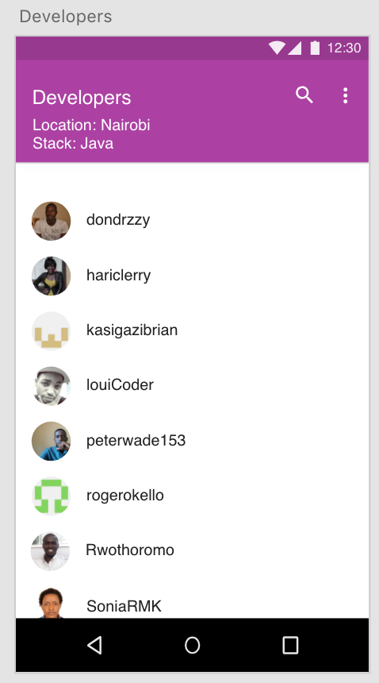
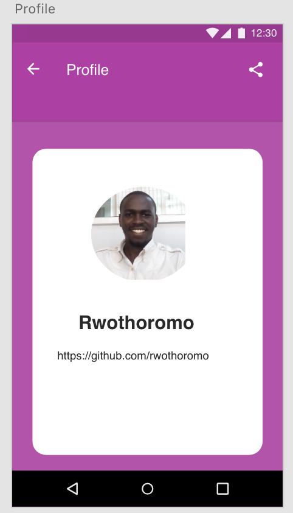
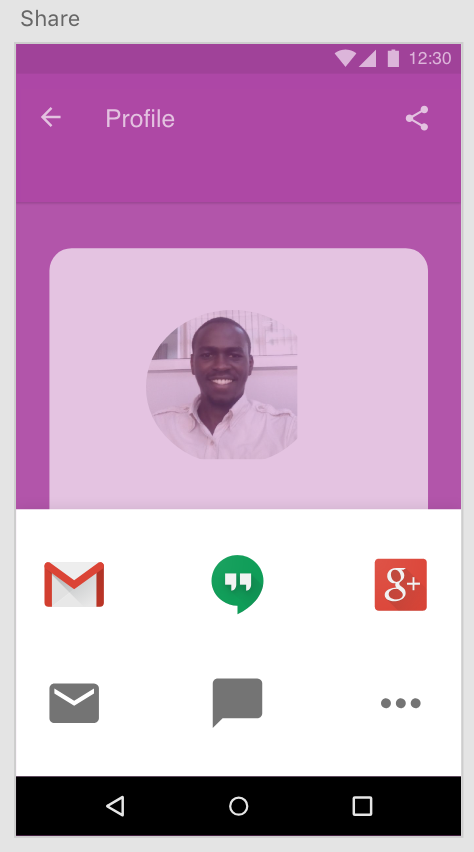

# Developers

[](https://circleci.com/gh/Rwothoromo/Android-Codelab)
[](https://codeclimate.com/github/Rwothoromo/Android-Codelab/test_coverage)
[](https://codeclimate.com/github/Rwothoromo/Android-Codelab/maintainability)

This Android application retrieves a listing of Java Developers in Nairobi using the [Github API](https://developer.github.com/v3/search/#search-users) and allows you to share their profiles.

## Design

The design mockup is for the following pages:

| 1. Developers list.                                             | 2. Developer profile.                                    | 3. Share profile.                                   |
| ---------------------------------------------------- | ------------------------------------------------ | ------------------------------------------------ |
|  |  |  |

Try out the [interactive design](https://xd.adobe.com/view/29abd095-a127-41b9-49bf-aaecbbc9f0ad-5f9a/).

The design was based off [Material Design](https://material.io/design/) and created using [Adobe XD](https://www.adobe.com/africa/products/xd.html), a free and effective tool that also allows publishing one's design as well as testing the design with ease on a Smart Phone.

## Project setup

These instructions will guide you on how to set up this Android project on your local machine.

### Prerequisites

- [Android Studio 3.1.3](https://developer.android.com/studio/)
- [Java (JDK 10)](http://www.oracle.com/technetwork/java/javase/downloads/jdk10-downloads-4416644.html)

### Installation

Clone this repository by running the following command in your terminal:
```
$ git clone https://github.com/Rwothoromo/Android-Codelab.git
```

### Open and run the project in Android Studio

- Start Android Studio and select `Open project` then browse this project at `path-to-project/Android-Codelab`.
- Wait for the project to complete building.
- Go to `Run` in the menu and select `Run` to run the project on an emulator or your connected Android device.

### Run tests

To run all checks, run the following command in your terminal:
```
$ ./gradlew check
```

To run Espresso tests on all connected devices:
```
$ ./gradlew connectedCheck
```

To install and run Espresso instrumentation tests for all flavors on connected devices:
```
$ ./gradlew connectedAndroidTest
```

To run unit tests for all variants:
```
$ ./gradlew test
```

### Reporting

Before running any of these commands, run `./gradlew clean` to clear any previous reports.
 
To Generate JaCoCo coverage reports:
```
$ ./gradlew jacocoTestReport
```

To Generate a coverage report with both local unit tests and instrumentation tests:
```
$ ./gradlew unifiedCoverageReport
```
